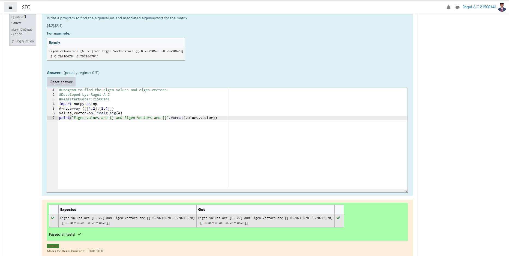

# EIGENVALUES-AND-EIGENVECTORS
## Aim:
To write a python program to find the Eigenvalues and Eigen Vectors
## Equipment’s required:
1. 	Hardware – PCs
2. 	Anaconda – Python 3.7 Installation / Moodle-Code Runner
## Algorithm:
### Step1 : 
import the numpy module to use the built-in functions for calculation
### Step 2: 
prepare the list from each inverse of the matrix and assing in np.array()
### Step 3: Using the np.linalg.eig(),  we get two results (first is eigenvalue and second is eigenvector) of the given matrix.
### Step 4: 
end the program
## Program:
```
#Program to find the eigen values and eigen vectors.
#Developed by: Ragul A C
#RegisterNumber:21500141
import numpy as np
A=np.array ([[4,2],[2,4]])
values,vector=np.linalg.eig(A)
print("Eigen values are {} and Eigen Vectors are {}".format(values,vector))
```
## Output:

## Result:
Thus the Eigenvalue and Eigenvector is successfully solved using python program
